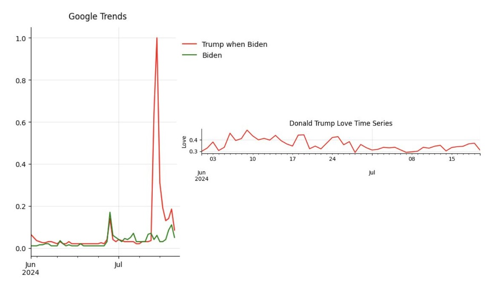

# Interpretation of obtained results

### 1. **Patterns, Relationships, and Trends**

#### Lack of Strong Relationships

The lack of significant values in the exogenous coefficients observed in the ARIMA models suggests that the support levels for Trump, Biden, and Harris on Reddit do not directly correlate with external metrics representing offline population behaviors, such as polling data or Google search trends.

These low coefficients indicate that, while fluctuations in Reddit support are evident, they neither drive nor are significantly influenced by changes in public opinion as captured by polling data. The consistently low exogenous coefficients further suggest a weak or non-existent relationship between the support levels for each candidate across different subreddits and the external metrics.

This implies that variations in online support, as seen through Reddit activity, do not directly align with broader measures of public interest or electoral sentiment during the period leading up to the elections.

**Note: this can be shown visually maybe a little heatmap of exogenous coefficients

#### High Volatility

The consistently low order of all ARIMA models applied to the data underscores the high volatility of support levels observed on Reddit. This volatility suggests that fluctuations in candidate support are largely unpredictable and show no significant relationships between past and present values when analyzed over extended periods, such as more than one or two days. These findings indicate a lack of temporal dependency or persistence in support values, which reflects the transient and dynamic nature of online discussions in this context.

This volatility points to event-driven, short-lived support levels, mirroring the dynamic and reactive nature of online discussions.

**Note: this could be more easily seen maybe with the shift in topics and support in same time periods if we can find any worth showing.

#### A Case Worth Mentioning

A notable exception occurred during Joe Biden's presidency, where a decline in Reddit support for Donald Trump was accompanied by an increase in Google search activity related to him. This isolated instance suggests a potential causal relationship, where reduced online support on Reddit triggered heightened public curiosity or concern, as reflected in Google search trends. However, the rarity of such occurrences highlights their exceptional nature rather than pointing to a broader, consistent trend.

### 2. **Connection to the Research Questions**

The study's hypotheses are only partially supported by the findings. The analysis revealed no statistically significant correlation between Reddit-derived support values and polling results for Joe Biden, Donald Trump, or Kamala Harris. Fluctuations in online sentiment on Reddit did not consistently align with broader public opinion captured in polling data. This lack of correlation is underscored by the low exogenous coefficients in the models, suggesting that sentiment on Reddit may not serve as a reliable proxy for electoral support or polling trends.

Similarly, the anticipated positive relationship between sentiment changes on Reddit and Google Trends search volumes was not consistently observed. While one notable instance occurred during Joe Biden's presidency, where a decline in support for Donald Trump on Reddit coincided with increased search activity for him, this was an isolated case and not representative of a broader trend. This suggests that sentiment shifts on Reddit are largely reactive to specific events rather than predictive of broader public interest or behavior.

Additionally, the study revealed potential biases in data selection, especially regarding Kamala Harris. Sentiment analysis in the days leading up to the election indicated that Reddit users favored Harris, suggesting that she should have won based on online discourse. However, Donald Trump ultimately prevailed. This discrepancy points to a disconnect between online sentiment and real-world electoral outcomes, further challenging the hypothesis that Reddit sentiment can reliably predict shifts in public support or interest. In conclusion, while Reddit sentiment offers some insights into the dynamics of online discourse, its predictive value for polling trends and broader public opinion remains limited.
