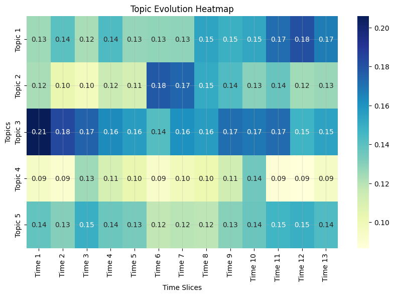

# Results obtained from each data mining technique

### 1. **Dynamic Topic Modeling**
- **Topic Evolution Heatmap**:  
    The intensity of cells reflects the prominence of each topic during specific time slices, enabling a clear visualization of how topics evolve over time. This highlights shifts in focus and reveals time-dependent changes. By examining the keywords associated with each topic, we can contextualize its theme and track how it responds to external factors, such as events or trends. 

    

### 2. **Time Series-Support Score Analysis**

### 3. **Correlation with Polls, Google Trends and Sentiment**
Every possible combination of polling data or search interest with sentiment was analyzed:
         - **Trump-Biden Period**: 
            - Polls (Trump) with sentiment for Trump and Biden individually, and combined.
            - Polls (Biden) with sentiment for Trump, Biden, and their combination.
         - **Trump-Harris Period**: 
            - Polls (Trump) with sentiment for Trump and Harris individually, and combined.
            - Polls (Harris) with sentiment for Trump, Harris, and their combination.  
         - The same combinations were repeated for Google search interest data.  

