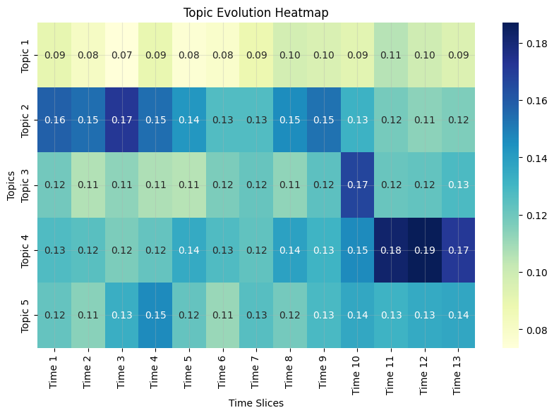

# Results obtained from each data mining technique

### 1. **Dynamic Topic Modeling**
- **Topic Evolution Heatmap**:  
    The intensity of cells reflects the prominence of each topic during specific time slices, enabling a clear visualization of how topics evolve over time. This highlights shifts in focus and reveals time-dependent changes. By examining the keywords associated with each topic, we can contextualize its theme and track how it responds to external factors, such as events or trends. 

    

### 2. **Time Series-Support Score Analysis**
   - **Trump-Biden Period**:  

      

   - Trump support prediction with AR(1), AIC	-151.173, BIC	-145.753, HQIC	-149.153

      

   - Biden support prediction with MA(1), AIC	-126.029, BIC	-120.609, HQIC	-124.009

      

   - **Trump-Harris Period**:

      

   - Trump support prediction with AR(1), AIC	-296.153, BIC	-288.523, HQIC	-293.071
  
      

   - Harris support decomposed for seasonality check, period = 30 

      

   - Harris support prediction with ARIMA(1,0,0)(0,0,1)[30] model, AIC	-240.721, BIC	-230.548, HQIC	-236.612

      

   - **Suport difference between Trump and Biden and Trump and Harris**:

      

   - **Support difference prediction between Trump and Biden**:

   - Support difference prediction with ARIMA(0,1,2) model, AIC	-107.668, BIC	-100.532, HQIC	-105.022
   
      

   - **Support difference prediction between Trump and Harris**:
  
   - Support difference prediction with AR(1), AIC	-190.973, BIC	-183.343, HQIC	-187.891

        

### 3. **Correlation with Polls, Google Trends and Sentiment**
   Every possible combination of polling data or search interest with support score was analyzed:
   - **Sentiment as exogenous variable for polls**:
      - Trump polls on Biden period:
         - Trump love as exogenous coefficient: **0.0179**
         - Biden love as exogenous coefficient: **-0.0008**
         - Biden and Trump love as exogenous coefficients: **-0.0009**, **0.0174**
       - Biden polls:
         - Trump love as exogenous coefficient: **-0.0047**
         - Biden love as exogenous coefficient: **0.0024**
         - Biden and Trump love as exogenous coefficients: **0.0026**, **-0.0049**
       - Trump polls on Harris period:
         - Trump love as exogenous coefficient: **0.0017**
         - Harris love as exogenous coefficient: **-0.0006**
         - Harris and Trump love as exogenous coefficients: **-0.0005**, **0.0017**
       - Harris polls:
         - Trump love as exogenous coefficient: **-0.0052**
         - Harris love as exogenous coefficient: **0.0011**
         - Harris and Trump love as exogenous coefficients: **0.0013**, **-0.0059**
   - **Setiment as exogenous variable for google searches**:
     - Trump google searches on Biden period:
       - Trump love as exogenous coefficient: **-0.7114**
       - Biden love as exogenous coefficient: **0.0767**
       - Biden and Trump love as exogenous coefficients: **0.0291**, **-0.6402**
     - Biden google searches:
       - Trump love as exogenous coefficient: **-0.1842**
       - Biden love as exogenous coefficient: **0.0066**
       - Biden and Trump love as exogenous coefficients: **0.0155**, **-0.1861**
     - Trump google searches on Harris period: 
       - Trump love as exogenous coefficient: **-0.0711**
       - Harris love as exogenous coefficient: **0.0265**
       - Harris and Trump love as exogenous coefficients: **0.0262**, **-0.0710**
     - Harris google searches:
       - Trump love as exogenous coefficient: **-0.0713**
       - Harris love as exogenous coefficient: **0.0617**
       - Harris and Trump love as exogenous coefficients: **0.0613**, **-0.0713**

